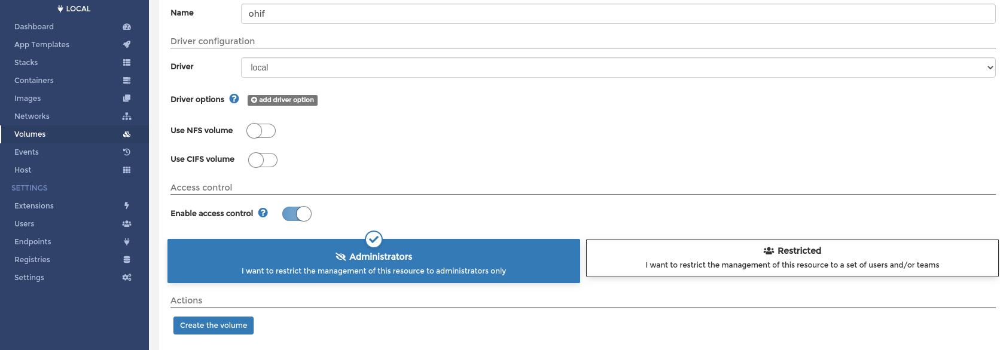
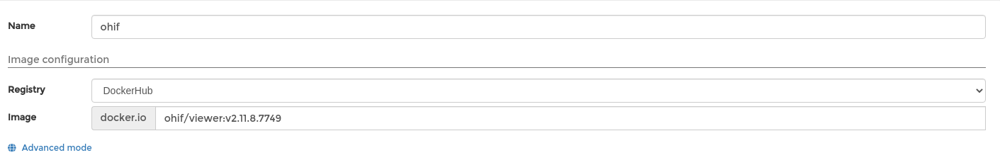
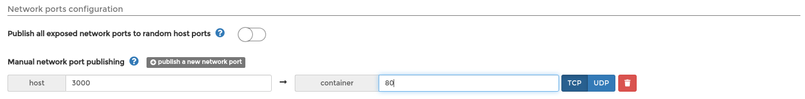
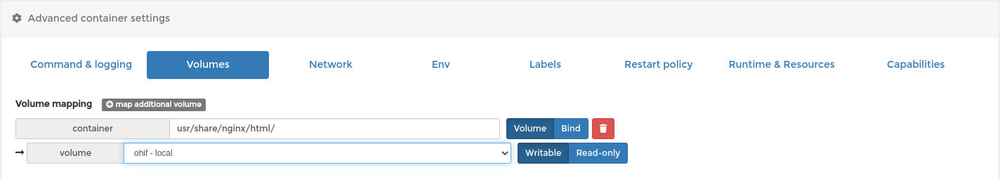

# Integrate DCM4CHE with OHIF using docker

DCOM4CHE: a collection of open source applications and utilities for the healthcare enterprise.

Ohif: Viewer is a zero-footprint medical image viewer provided by the Open Health Imaging Foundation (OHIF). It is a configurable and extensible

You must have previously installed **docker**, **docker-compose** and **portainer**  on your machine.

After downloading the docker-compose.yml and .env files, run the commands below.

## dcm4chee

Ininitialize dcm4chee container using docker-compose
```bash
docker-compose -p dcm4chee up -d
```
to stop 
```bash
docker-compose -p dcm4chee stop
```

## Portainer
To download and configure ohif, we will use the portainer interface.

Create ohif volume:



Create ohif container:



In Network ports configuration
click in **_publish a new network port_** and define host to **3000** and container to **80**



In Advanced container settings, go to **_Volumes_** section. Defines container to __/usr/share/nginx/html/__ and select your __ohif-local__ volume.



## Ohif
After you have made all these settings, you must change __app-config__ to use your dcm4che container

You can use the below command to edit the file in nano if you have the volume created as in the portainer aproach:

```bash
sudo nano /var/lib/docker/volumes/ohif/_data/app-config.js
```

```bash
    wadoUriRoot: 'http://<local ip address>:8080/dcm4chee-arc/aets/DCM4CHEE/wado',
    qidoRoot: 'http://<local ip address>:8080/dcm4chee-arc/aets/DCM4CHEE/rs',
    wadoRoot: 'http://<local ip address>:8080/dcm4chee-arc/aets/DCM4CHEE/rs',
```

* PS. don't forget to check if your dcm4che instance is started

After that save the file and close.

Please update your browser. It is normal not to update from immediately. Just in case, restart your ohif container.

## References

[dcm4che w/ docker](https://docs.ohif.org/history/v1/connecting-to-image-archives/dcm4chee-with-docker.html) 
[configure ohif](https://openintegrator.com/how-to-install-ohif-web-based-dicom-viewer-in-docker-and-connect-to-dcm4chee-vna/)


